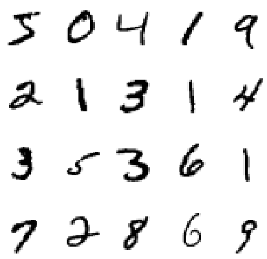

# Handwritten Digits Recognition

## Objective
The main objective of this project is to build a CNN for MNIST dataset to predict handwritten digits.

## Outcome:
The expected outcome is the CNN model trained in TensorFlow with accuracy >= 99%.

## Setup:
Required data for running the model including:
- Jupyter Notebook file
- `Data` folder: TensorFlow model 20 & 24 and train + test data are zipped and uploaded (`data_cnn_mnist.zip`) in Google Drive.

Link: https://drive.google.com/file/d/1Dpg0ZsPZhcQMV0qML_264yIh7VzewuiB/view?usp=sharing

## Follow-up work:
In order to improve the current accuracy, the next step is to apply the DropConnect Network which was introduced in the paper "Regularization of Neural Networks using DropConnect" by Li Wan et. al. (https://cs.nyu.edu/~wanli/dropc/)

